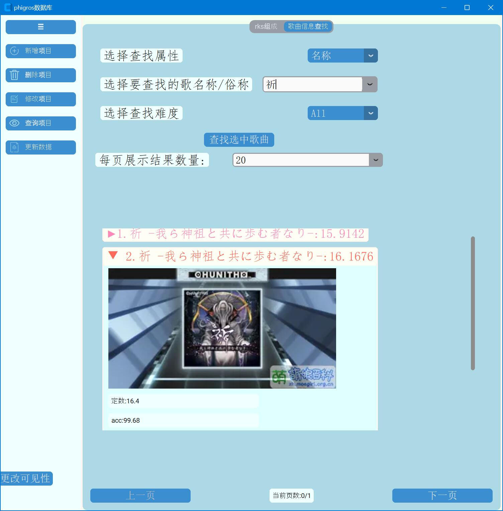
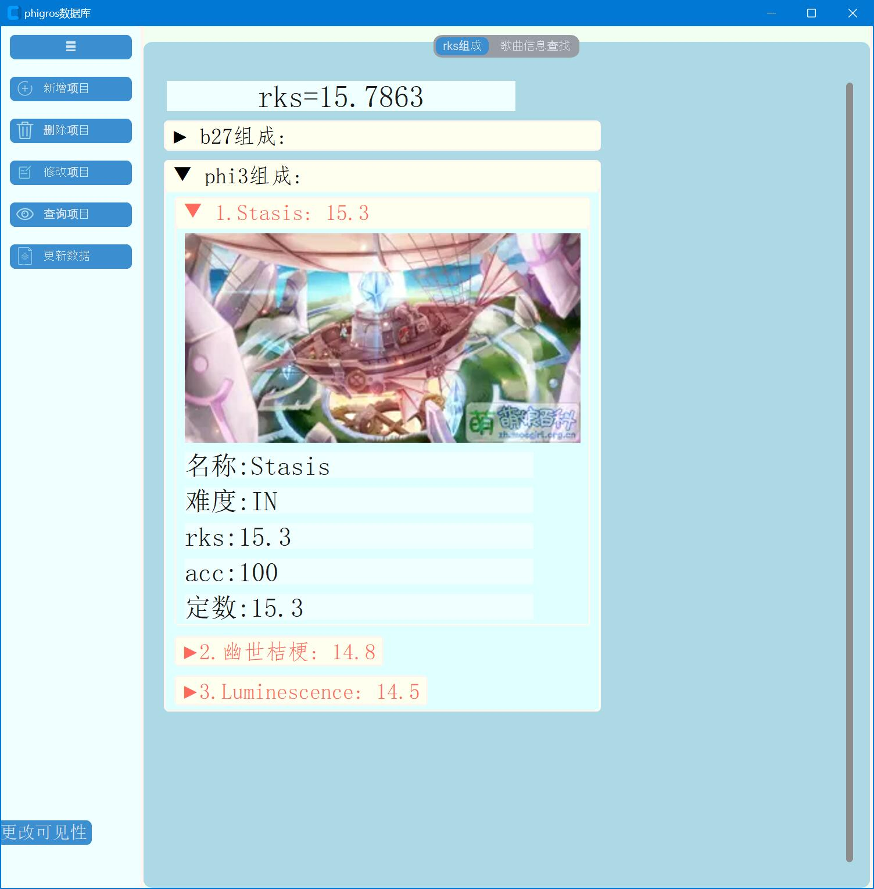

# Phigros个人数据库

## 📖 项目简介
提供**rks组成** 及根据 曲名、俗称、曲师、所属章节、单曲rks、定数、难度、acc、**简评** 等参数对游玩数据进行的筛选，可以更好地筛选值得推分的歌曲。
**⚠️⚠️⚠️注意：1.0版本只能手动或使用爬虫(不稳定)维护数据库，2.0会实现与QQ机器人相似的授权流程，授权后可自动更新数据。目前暂无安装包**

简评由用户自行编辑，用于记录特定歌曲特定难度的相关信息(歌曲难点、推歌感受等)且可作为搜索依据进行模糊匹配
rks组成页面默认折叠，只展示名称/俗称与单曲rks，可点击展开且支持自定义展开时显示的属性

## 🔍项目细节
* 首先布局查询项目页面，方便直接查看rks。每一页布局完成后即可使用，无需等待所有页面布局完成。
* 所有曲名相关的输入框都支持模糊搜索、俗称转换曲名
* 切换时保留每一页正在更改的内容

### 增添数据
* 选择曲名/俗称之后自动填充曲名，筛选可添加难度

### 修改数据
* 选择歌曲后显示对应曲绘，输入框自动填充原属性的内容，下方文字显示原属性值。更改acc、定数时还会显示单曲rks及b27、phi3地板值
* 在更改名称或曲师后自动同步更改歌曲输入框的内容，以便继续更改当前歌曲的其他属性
* 改低acc之后弹出二次询问框

### 查询数据
* 可更改可见性的属性有：曲名、曲师、曲绘、定数、acc、单曲rks、简评(默认显示属性)及章节、bpm、时长、画师、物量、谱师
* 使用颜色差分歌曲的不同难度
* 边查询边布局查询结果

### 开发相关
* 提供pytest测试数据对输入合法性检测函数进行测试

## 💾待开发功能

### 近期工作
- [ ] 更-接入TapTap API(取代增删功能和更改的部分功能)
- [ ] 查-可见性更改 的持久化
- [ ] 改-B27 Phi3只在rks相关属性下显示

### 长期任务
- [ ] 改&查-提供歌曲分组选项并加入筛选依据
- [ ] 通用属性改成cnt的形式否则删除维护的时候不确定要不要删
