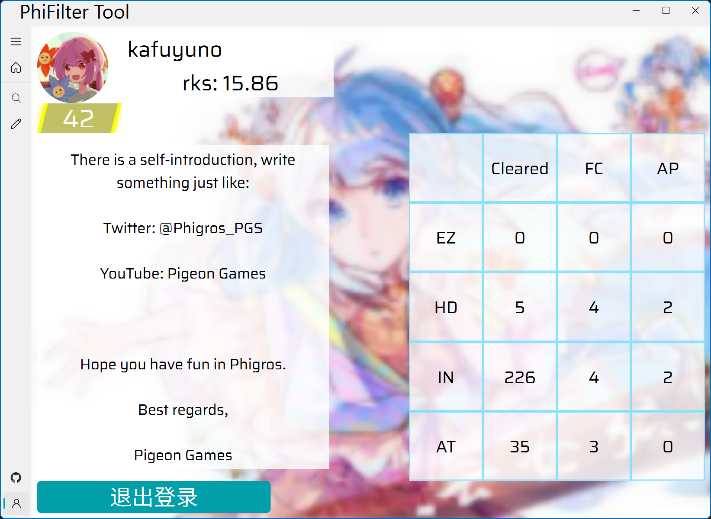
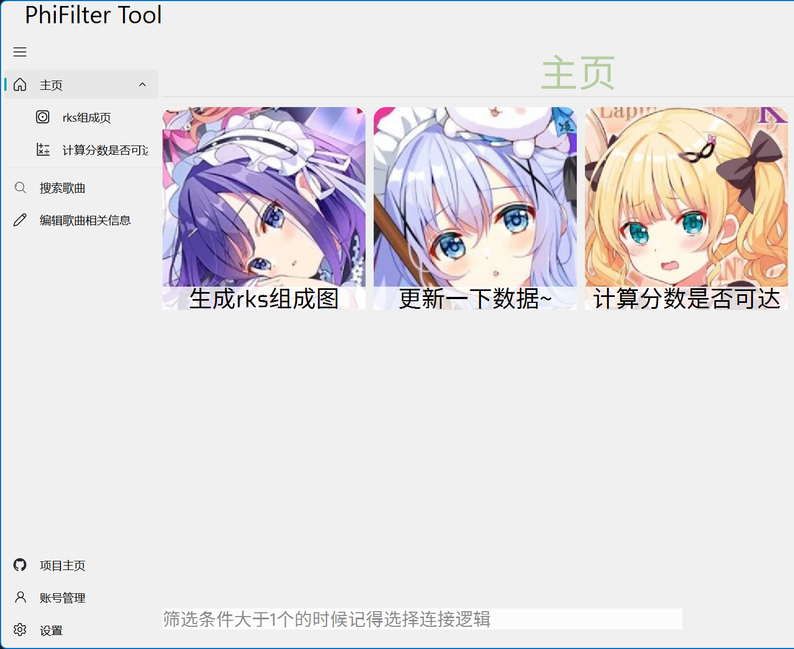
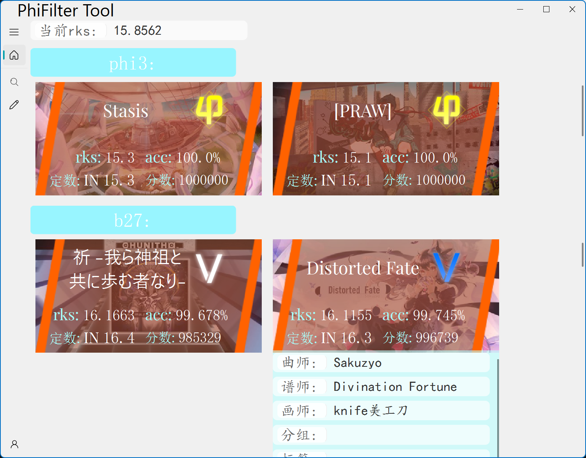
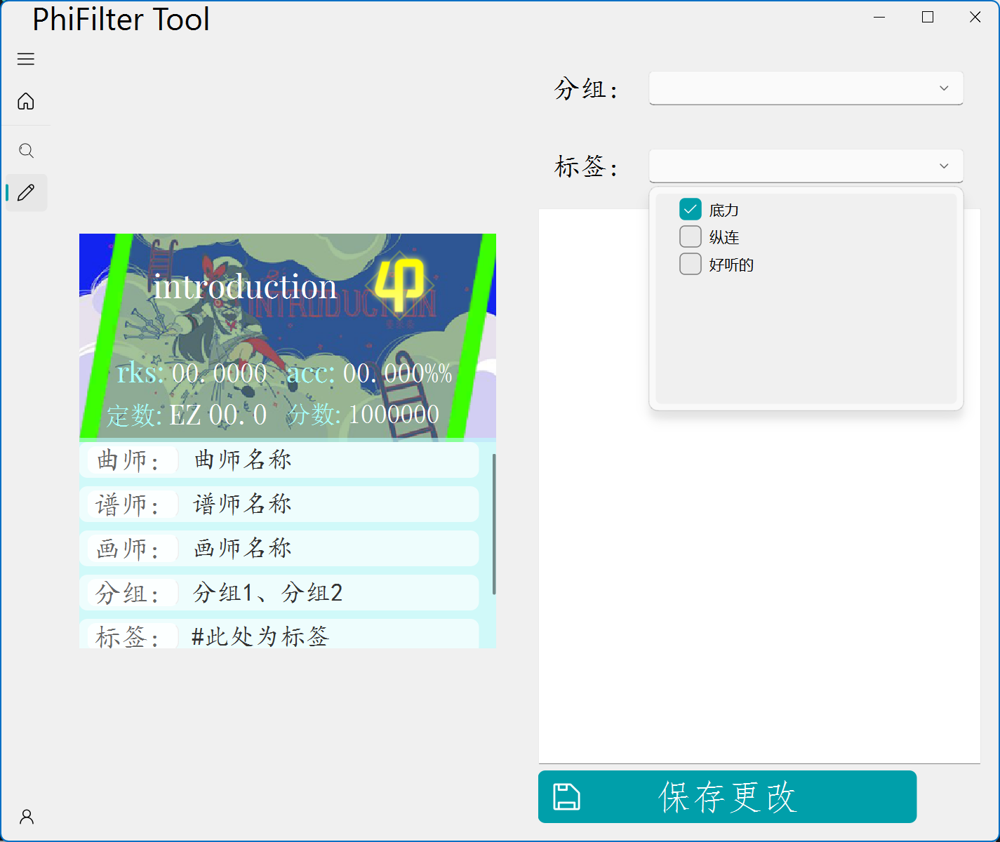

# PhiFilter_Tool
[中文](./README/README_zh-CN.md)

A tool for filtering rhythm game Phigros gameplay data

## Quick Start
Download the exe file from the release part and open it to enter the account page. Start authorization (the account page when not logged in is shown below).

### Authorization Process:
1. Click the button to generate a QR code
2. Scan the QR code with TapTap and authorize

After successful authorization, the account page will display your in-game avatar, background, RKS, and other account information. You can then proceed to the home page or search page to start using the tool.

## Detailed Introduction
### Home Page

Provides quick tools. Hover over the tool title to see detailed information.
There are usage tips for each page in the bottom left corner, randomly loaded when refreshing the home page.

#### Tool Introduction:
1. **Generate rks Composition Chart**

* Left-click the **phi3**, **b27** buttons to toggle between collapsed/expanded modes
* Left-click **song cards** to toggle detailed information (composer, Charter, illustrator) collapsed/expanded modes

> [!tip]
>
> All **song cards** support the above operation

2. **Update Data**

* In lazy loading mode (default), the app automatically updates once at startup. Subsequent filtering and RKS chart generation operation will reuses stored data. If there are updates in your game(scores, avatar, nickname, etc.), please sync in Phigros first, then click update card here.
* Constant loading mode can be adjusted in settings. In this mode, data is pre-updated each time you generate RKS charts or search, but runtime will be longer.

3. **Calculate If Score Is Achievable**

* For a specified song and difficulty, input the target score to check if it's achievable. If achievable, it will display the required Perfect count, Great count, Bad+Miss count, and max combo needed.

* The results section supports sorting by any of the four parameters in ascending or descending order.

### Filter Page

#### Filter Condition Input
* Available filter attributes:
    * acc
    * Single rks
    * Score
    * Chart level
    * Grade 
    * Difficulty
    * Song Name
    * Composer
    * Charter
    * Illustrator

* When filter values can be enumerated (e.g., Grade , Difficulty, Song Name, Composer, Charter, Illustrator), input provides option lists and auto-completion. Use the up/down arrow keys to navigate options and press Enter to confirm.

* Click the plus button to add a filter condition. With multiple conditions, you must select the connection method (**AND/OR**). All conditions must be valid; invalid conditions will prevent filtering.

* Click the minus button to remove selected filter conditions, but at least one condition must remain.

* After entering filter conditions, click **Filter All Songs** to search, or click **Filter Within Results** to refine existing results.

#### Search Result Layout
* Right-click **song cards** in search results to show a menu for jumping to edit page or score calculation page.

* Changing **Sort By**, **Group By**, or **Sort Order** will re-layout results. Click **Reset** to refresh the page.

* **Sort By** options:
    * None (default)
    * acc
    * Single rks
    * Score
    * Chart Level

* **Sort Order** defaults to descending (only effective when Sort By is not "None")

* **Group By** options:
    * None (default)
    * Song Name
    * Composer
    * Charter
    * Illustrator
    * Difficulty
    * Grade

When Group By is "None", all results are displayed flat. Otherwise, results are grouped in collapsible sections.

* **Number of Songs Displayed** limits the maximum songs per group (or total songs if no grouping). This limit applies after search results are generated.

> [!tip]
>
> If you can't find a specific difficulty for a song, it might because you haven't played that difficulty, so it's not recorded in your save data.

### Edit Page

* Add/remove selected songs from groups or tags (multiple selection supported). Existing groups/tags appear in dropdown. To create new ones, input and save. Changes sync group selection status across all pages.
* The blank area below is for brief comments - you can complain about abstract chart configurations or record gameplay feelings/difficult points for quick reference when returning to the game.
* Comments and groups are account-associated. Switching accounts loads the corresponding files.

### Account Page
> Recommended to use at default size

Avatar and background match your in-game settings.
Your in-game self-introduction appears above the logout button.
The right side shows song counts for each difficulty and status.

## Reference Projects
User data acquisition and QR code generation use the following projects:
- [Phi-CloudAction-python](https://github.com/wms26/Phi-CloudAction-python)
- [Phi-GetSession-python](https://github.com/wms26/Phi-GetSession-python)

Both are created by [wms26](https://github.com/wms26).

Avatar, Chart Level, and illustration information uses [7aGiven](https://github.com/7aGiven)'s [Phigros_Resource](https://github.com/7aGiven/Phigros_Resource) project to update.

Thanks to both masters!

## TODO List
- [ ] Lazy loading scroll (might take a while...)