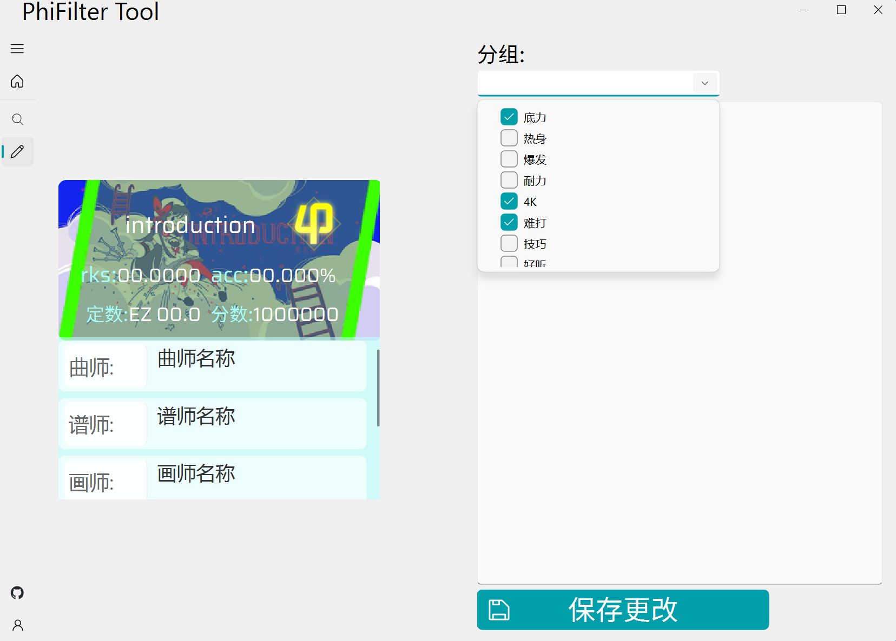

# PhiFilter_Tool
一个筛选Phigros打歌数据的工具

## 快速开始
下载release中的exe文件 点击后进入账号页面 开始授权(未登录时账号页面如下图所示)

授权流程：

1. 点击按钮生成二维码
2. 用TapTap扫描二维码并授权

账号页面在授权成功后将显示游戏中的头像 背景 rks等账号信息 之后可前往主页或搜索页开始使用

## 详细介绍
### 主页

提供快捷工具 鼠标悬浮在工具标题上可以展开详细介绍
左下角有各个页面使用相关的tips 刷新主页随机加载

#### 工具介绍:
1. 生成rks组成图

* 左键点击**phi3**、**b27**按钮可以切换 折叠/展开 模式  
* 左键点击**歌曲卡片**可以切换详细信息(曲师 谱师 画师) 折叠/展开 模式 
* 右键点击**歌曲卡片**将跳转编辑页面 (暂无功能)

> [!tip]
>
> 所有的**歌曲卡片**都可以进行如上操作

2. 更新数据

应用启动时会自动更新一次 后续 筛选/生成rks组成 时复用储存的数据 如有更新(分数 头像 昵称等) 请在Phigros中同步之后在此点击更新

### 筛选页面

#### 筛选条件输入
* 可供筛选的属性有:
    * acc 
    * 单曲rks 
    * 得分 
    * 定数 
    * 评级 
    * 难度 
    * 曲名 
    * 曲师 
    * 谱师 
    * 画师 

* 筛选值若可以枚举 (如筛选属性为 **评级 难度 曲名 曲师 谱师 画师** 时) 输入提供可选项列表以及自动补全

* 点击加号可以增加一个筛选条件 在多个筛选条件下必须选择连接方式 (**并且(与)/或者(或)**) 所有条件必须有效 存在无效条件将不会进行筛选

* 点击减号可以清楚选中的筛选条件 但是必须有至少1个筛选条件存在

* 筛选条件输入完成后可以点击**从所有歌曲中筛一遍**按钮进行筛选 或是在已经有筛选结果的基础上点击**从结果中继续筛选**按钮

#### 筛选结果布局
* 每次切换 **排序依据** **分组依据** 或 **排序顺序** 都会重新布局筛选结果 点击 **重置** 按钮可以刷新页面

* **排序依据**可选值为: 
    * 无(默认) 
    * acc 
    * 单曲rks 
    * 得分 
    * 定数

* **排序顺序**默认从大到小(当排序依据不为 **无** 的时候才生效)

* **分组依据**可选值为: 
    * 无(默认) 
    * 曲名
    * 曲师 
    * 谱师
    * 画师 
    * 难度 
    * 评级 

分组依据为 **无** 的时候平铺所有筛选结果 否则按照分组依据以可折叠的样式分组
> [!tip]
>
> 如果找不到歌曲的某个难度 有可能是没有玩过该难度 因此存档中没有记录

### 编辑页面

> 待完善

* 可以在此将选中的歌曲 加入/移除 某个分组或标签 可多选 已存在的 分组/标签 会展示在下拉框中 如需新建 输入后保存更改即可
* 下方空白处是简评输入栏 可以吐槽该难度下抽象的配置 也可以记录打歌感受或难点以便复健的时候快速找回记忆(

### 账号页面
> 此页面建议以默认尺寸使用

头像与背景与游戏中的设置相同 
退出按钮上方显示游戏中的自我介绍 
右侧显示每个难度不同状态的歌曲数量

## 参考项目
本项目的 用户数据获取 二维码生成部分 分别用的是[Phi-CloudAction-python](https://github.com/wms26/Phi-CloudAction-python)项目以及[Phi-GetSession-python](https://github.com/wms26/Phi-GetSession-python)项目 都是[千柒](https://github.com/wms26)写的喵；

头像 定数 曲绘等信息获取用的是[文酱](https://github.com/7aGiven)的[Phigros_Resource](https://github.com/7aGiven/Phigros_Resource?tab=readme-ov-file)项目

感谢两位大佬！

## 正在做的东西
- [ ] 编辑页面添加分组 简评功能制作 适配多账号
- [ ] 懒加载的scroll
- [ ] 在有排序依据的基础上加入数量限制可选项
- [ ] 加入设置页面
- [ ] 做一个指定歌曲及难度 求如何达到指定分数的快捷工具
