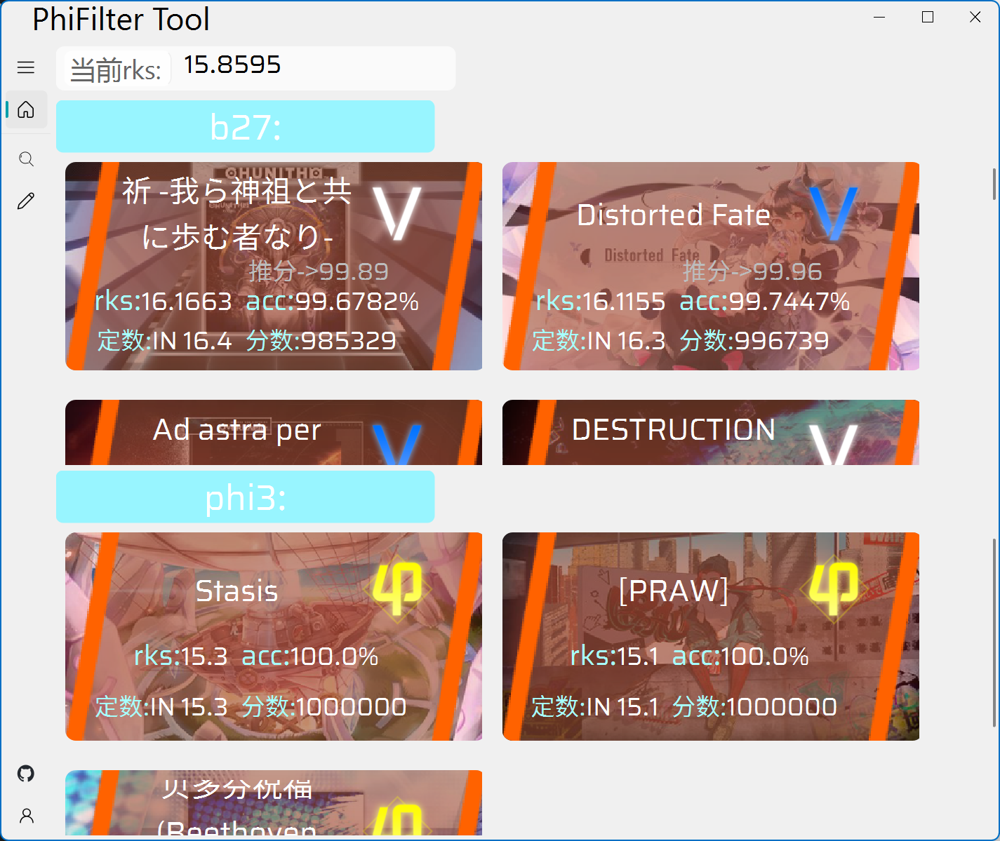

# PhiFilter_Tool
一个筛选打歌数据的工具

## 1. 使用
> 改完布局之后会加入exe文件

### 1.1. 账号页面
授权流程：
* 点击按钮生成二维码
* 用TapTap扫描二维码并授权
* 回到账号页面 授权成功后会显示游戏中的头像与退出登录按钮

### 1.2. 主页
提供快捷工具:
1. 生成rks组成

* 左键点击`phi3` `b27`按钮可以切换 折叠/展开 模式  
* 左键点击**歌曲卡片**可以切换详细信息(曲师 谱师 分组 标签 简评) 折叠/展开 模式 
* 右键点击**歌曲卡片**将跳转编辑页面 可以对 分组 标签 简评 信息进行自定义编辑
> 注: 所有的**歌曲卡片**都可以进行如上操作

2. 制作中...

### 1.3. 筛选页面

#### 1.3.1. 筛选条件输入
* 可供筛选的属性有:`acc` `单曲rks` `得分` `定数` `评级` `难度` `曲名` `曲师` `谱师` `画师` `分组` `标签` `简评`

* 筛选值若可以枚举(如筛选属性为`评级` `难度` `曲名` `曲师` `谱师` `画师` `分组` `标签` `简评`) 则输入提供可选项列表以及自动补全

* 点击`+`号可以增加一个筛选条件 在多个筛选条件下必须选择连接方式 `并且(与)`/`或者(或)` 点击`-`号可以清楚选中的筛选条件 但是必须有至少1个筛选条件存在

* 筛选条件输入完成后可以点击`从所有歌曲中筛一遍`按钮进行筛选 或是在已经有筛选结果的基础上点击`从结果中继续筛选`按钮

#### 1.3.2. 筛选结果布局
* 每次切换 `排序依据` `分组依据`或`排序顺序`都会重新布局筛选结果 点击`重置`按钮可以刷新页面
* `排序依据`可选值为: `无`(默认) `acc` `单曲rks` `得分` `定数`
* `排序顺序`默认从大到小(当有排序依据的时候)
* `分组依据`可选值为: `无`(默认) `曲名` `曲师` `谱师` `画师` `难度` `评级` `分组` `标签` 分组依据为 `无` 的时候平铺所有筛选结果 否则按照分组依据以可折叠的样式分组
> 如果找不到歌曲的某个难度 有可能是没有玩过该难度 因此没有记录

### 1.4. 编辑页面

* 可以在此将选中的歌曲 加入/移除 某个分组或标签 可多选 已存在的 分组/标签 会展示在下拉框中 如需新建 输入后保存更改即可
* 下方空白处是简评输入栏 可以吐槽该难度下抽象的配置 也可以记录打歌感受或难点以便复健的时候快速找回记忆(

## 2. 参考项目
本项目的 用户数据获取 二维码生成部分 分别用的是[Phi-CloudAction-python](https://github.com/wms26/Phi-CloudAction-python)项目以及[Phi-GetSession-python](https://github.com/wms26/Phi-GetSession-python)项目 都是[千柒](https://github.com/wms26)写的喵；头像 定数 曲绘等信息获取用的是[文酱](https://github.com/7aGiven)的[Phigros_Resource](https://github.com/7aGiven/Phigros_Resource?tab=readme-ov-file)项目
感谢两位大佬！

## 3. 正在做的东西
- [ ] 优化代码 打包成exe文件
- [ ] 优化筛选结果重新布局的逻辑
- [ ] 解析用户的名称 课题模式评分 各难度数据
- [ ] 想想多账号怎么做
