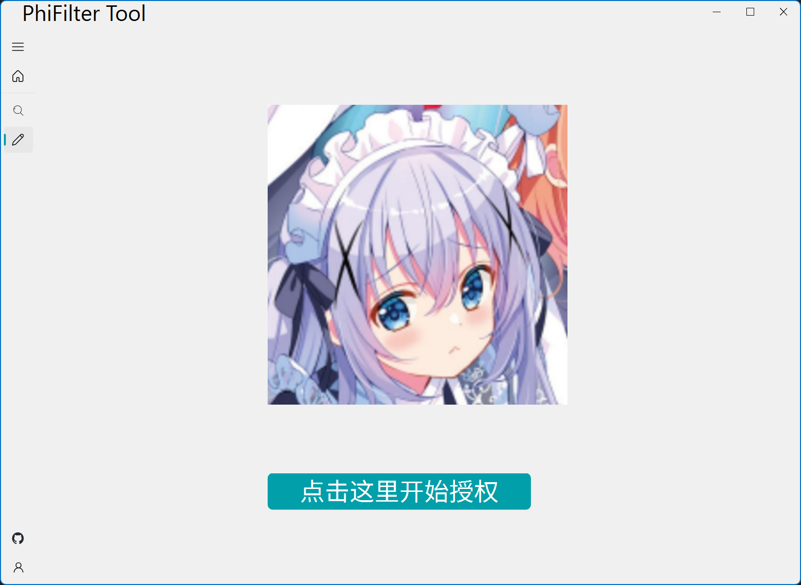
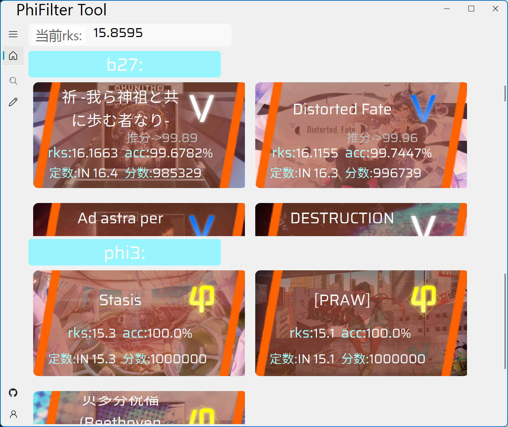
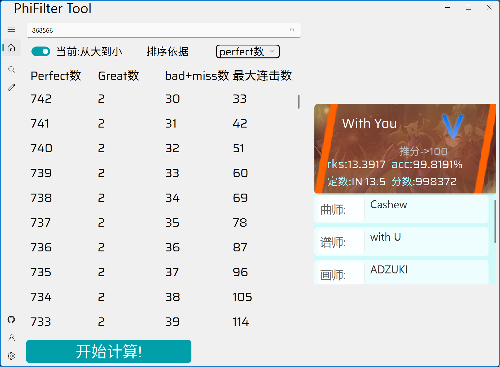
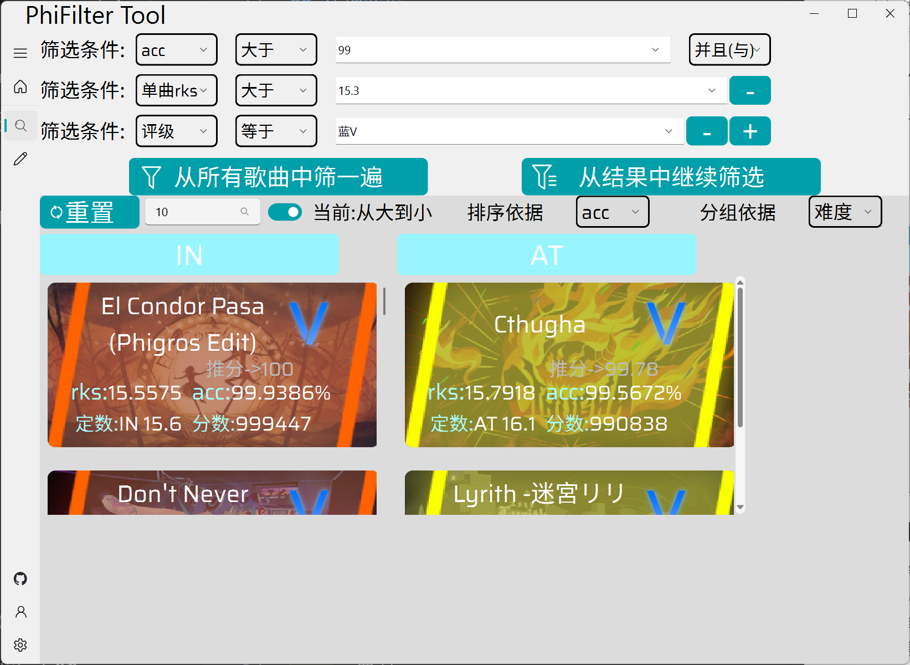
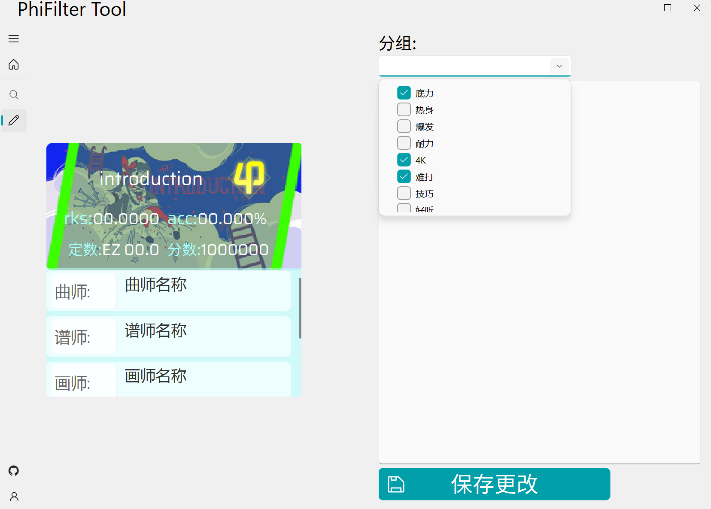

<h1 align="center">PhiFilter Tool</h1>

<p align="center">
 
  
  
  </br>
  
  
  
</p>

<p align="center">
<a href="../README.md">English</a> | 简体中文
</p>

一个筛选Phigros打歌数据的工具

## ✨快速开始
若您是**开发者**，请移步[构建项目](#构建项目)

若您是**用户**，请继续查看下面的流程：

下载release中的exe文件 点击后进入账号页面 开始授权(未登录时账号页面如下图所示)



### 授权流程：

1. 点击按钮生成二维码
2. 用TapTap扫描二维码并授权

账号页面在授权成功后将显示游戏中的头像 背景 rks等账号信息 之后可前往主页或搜索页开始使用


## 📚详细介绍
### 主页

提供快捷工具 鼠标悬浮在工具标题上可以展开详细介绍
左下角有各个页面使用相关的tips 刷新主页随机加载


#### 🔧工具介绍:
1. **生成rks组成图**



* 左键点击**phi3**、**b27**按钮可以切换 折叠/展开 模式  
* 左键点击**歌曲卡片**可以切换详细信息(曲师 谱师 画师) 折叠/展开 模式 

> [!tip]
>
> 所有的**歌曲卡片**都可以进行如上操作

2. 🔄**更新数据**

* 懒加载(默认)状态下 应用启动时会自动更新一次 后续 筛选/生成rks组成 时复用储存的数据 如有更新(分数 头像 昵称等) 请在Phigros中同步之后在此点击更新
* 常加载状态可在设置页面调整 此状态下每次 生成rks组成图或进行搜索时都会预先更新一遍数据 但是运行时间会变长

3. 📝**计算分数是否可达**


* 对于指定歌曲的指定难度 输入目标分数并判断是否可达 若可达 则会在下方依次展示达到目标分数所需的 Perfect数 Great数 bad+miss数和最大连击数

* 结果展示部分支持依据四个参数中的任何一个进行升序或降序排列结果

### ⌨️筛选页面


#### 筛选条件输入
* 可供筛选的属性有:
    * acc 
    * 单曲rks 
    * 得分 
    * 定数 
    * 评级 
    * 难度 
    * 曲名 
    * 曲师 
    * 谱师 
    * 画师 

* 筛选值若可以枚举 (如筛选属性为 **评级 难度 曲名 曲师 谱师 画师** 时) 输入提供可选项列表以及自动补全 上下键切换待选项 Enter键确认

* 点击加号可以增加一个筛选条件 在多个筛选条件下必须选择连接方式 (**并且(与)/或者(或)**) 所有条件必须有效 存在无效条件将不会进行筛选

* 点击减号可以清除选中的筛选条件 但是必须有至少1个筛选条件存在

* 筛选条件输入完成后可以点击**从所有歌曲中筛一遍**按钮进行筛选 或是在已经有筛选结果的基础上点击**从结果中继续筛选**按钮

#### 筛选结果布局
* 在搜索页面右键搜索结果的**歌曲卡片**将显示菜单 可跳转编辑页面编辑该歌曲 或 跳转 分数计算页面

* 每次切换 **排序依据** **分组依据** 或 **排序顺序** 都会重新布局筛选结果 点击 **重置** 按钮可以刷新页面

* **排序依据**可选值为: 
    * 无(默认) 
    * acc 
    * 单曲rks 
    * 得分 
    * 定数

* **排序顺序**默认从大到小(当排序依据不为 **无** 的时候才生效)

* **分组依据**可选值为: 
    * 无(默认) 
    * 曲名
    * 曲师 
    * 谱师
    * 画师 
    * 难度 
    * 评级 

分组依据为 **无** 的时候平铺所有筛选结果 否则按照分组依据以可折叠的样式分组

* **歌曲展示个数** 限制的是每个分组中的最多歌曲数 如果没有分组 则限制所有歌曲的个数 此处歌曲个数的限制的逻辑是在搜索结果产生之后的 排序与分组限制的是整体的搜索结果 而在最终的排序后由**歌曲展示个数**参数控制最终展示的个数
> [!tip]
>
> 如果找不到歌曲的某个难度 有可能是没有玩过该难度 因此存档中没有记录


### 🖱️编辑页面



* 可以在此将选中的歌曲 加入/移除 某个分组或标签 可多选 已存在的 分组/标签 会展示在下拉框中 如需新建 输入后保存更改即可 每次更改后都会同步分组选中状态 在每个页面同步更新该歌曲的信息
* 下方空白处是简评输入栏 可以吐槽该难度下抽象的配置 也可以记录打歌感受或难点以便复健的时候快速找回记忆(
* 简评和分组都是与账号相关联的 切换账号后会读取对应的文件

### 💬账号页面
> 此页面建议以默认尺寸使用


头像与背景与游戏中的设置相同 
退出按钮上方显示游戏中的自我介绍 
右侧显示每个难度不同状态的歌曲数量

## 构建项目
### 前置需求

- Python 3.8+
- Git
- PyQt5 5.15.11
- PyQt-Fluent-Widgets 1.8.3
- pip install pandas 2.2.3
- pip install requests 2.32.3
- pip install pycryptodome 3.22.0
- pip install qrcode 8.2

### 步骤

1. 克隆仓库
```bash
git clone https://github.com/lightbluegit/PhiFilter_Tool
cd PhiFilter_Tool
```

2. 安装依赖
```bash
pip install -r requirements.txt
```

3. 运行项目

使用命令行
```bash
python main.py
```

或 打开`main.py`文件并运行

若您对本项目感兴趣，欢迎查看<a href="../Contribution/CONTRIBUTING.md">贡献</a>文档

## 参考项目
本项目的 用户数据获取 二维码生成部分 分别用的是[Phi-CloudAction-python](https://github.com/wms26/Phi-CloudAction-python)项目以及[Phi-GetSession-python](https://github.com/wms26/Phi-GetSession-python)项目 都是[千柒](https://github.com/wms26)写的

头像 定数 曲绘等信息获取用的是[文酱](https://github.com/7aGiven)的[Phigros_Resource](https://github.com/7aGiven/Phigros_Resource?tab=readme-ov-file)项目

感谢两位大佬！

## 🎮正在做的东西
- [ ] 懒加载的scrool(可能好久之后才会做了)
- [ ] 使用logging库输出日志